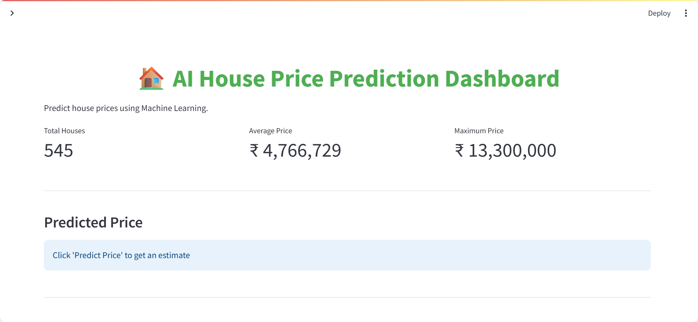
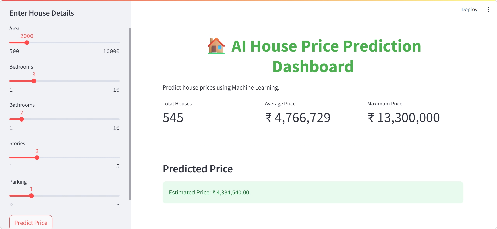

# 🏠 AI House Price Prediction Dashboard

An interactive Machine Learning web application that predicts house prices using housing features and visualizes real estate insights through a modern Streamlit dashboard.

---

## 📌 Project Overview

The AI House Price Prediction Dashboard is a Data Science and Machine Learning project developed using Python and Streamlit. The application predicts house prices based on user inputs such as:

- Area
- Bedrooms
- Bathrooms
- Stories
- Parking

The project also provides interactive dashboard analytics and visual insights for better understanding of housing data trends.

---
## 📸 Project Screenshots

### Dashboard Interface



### Prediction Result



---

## 🚀 Features

✅ House Price Prediction using Machine Learning  
✅ Interactive Streamlit Dashboard  
✅ Real-Time Price Estimation  
✅ KPI Metrics Display  
✅ Modern User Interface  
✅ Pie Chart & Bar Chart Visualizations  
✅ Housing Dataset Insights  
✅ Responsive Dashboard Layout  

---

## 🛠️ Technologies Used

- Python
- Streamlit
- Pandas
- NumPy
- Scikit-learn
- Plotly
- Matplotlib

---

## 📊 Machine Learning Model

This project uses:

### Random Forest Regressor

The model is trained on housing dataset features to predict property prices accurately.

---

## 📂 Dataset Used

Dataset: Housing Prices Dataset

Features included:
- Area
- Bedrooms
- Bathrooms
- Stories
- Parking
- Price

---

## 🖥️ Dashboard Preview

The dashboard includes:

- House Detail Input Sidebar
- Predicted Price Section
- Total Houses KPI
- Average Price KPI
- Maximum Price KPI
- Interactive Visual Charts

---

## 📁 Project Structure

```bash
AI-House-Price-Prediction-Dashboard/
│
├── app.py
├── model.py
├── housing.csv
├── house_model.pkl
├── requirements.txt
├── README.md
└── assets/